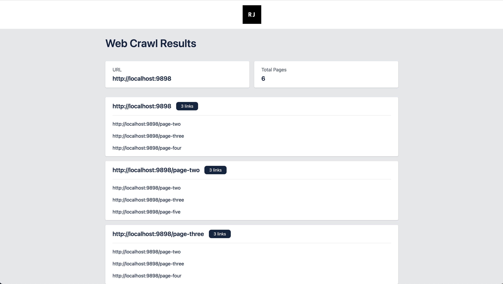

# Web Crawler 🌎🕸
A command line application to crawl all internal links for a specified URL and print each URL visited with a list of links found on that page to the console. 

### Rules
- Crawler will not follow external links, only internal
- No pre-built web-scraping frameworks to be used
- Smaller libraries are permitted (e.g. HTML parsing)

## Run Tests
`./gradlew test`

## Run Application
Run the application by providing arguments:
- The base URL to crawl
- The number of threads to run concurrently.

`./gradlew run --args='https://www.url-to-crawl.com 4'`

## Output 
Running the application will produce a HTML file of the crawl results at `/output/results.html`
 

## Questions & Queries
📩 [reece@reecejohnson.co.uk](mailto:reece@reecejohnson.co.uk?subject=Web%20Crawler)

